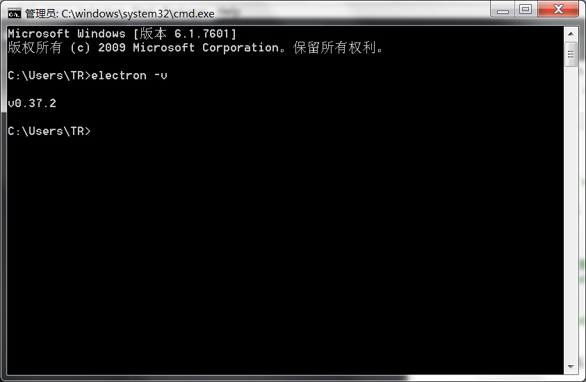
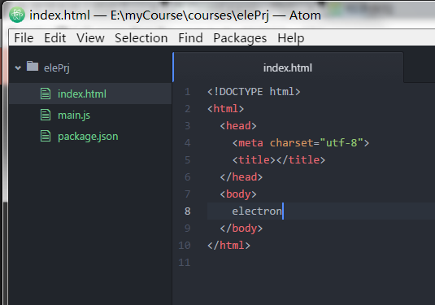

#如何使用 electron

##electron 介绍

`electron` 是一个框架，它是基于 `node.js` 和 `chromium` 的，它允许你使用javascript、html、css来编写跨平台的桌面应用，推荐使用 `atom` 编辑器。

>注：可以放心使用node，框架内部已经集成了

##安装 electron

前提已经安装了 `node` 、 `npm`.

一下安装都可使用 `npm` 或 `cnpm`.


```sh
# 全局安装 `electron` （推荐）
npm install electron-prebuilt -g

# 作为开发依赖局部安装
npm install electron-prebuilt --save-dev
```

>全局安装成功测试：cmd中输入electron -v



##构建项目

1、新建项目文件夹：elePrj ;

2、创建 `package.json` 加载文件 ;

3、创建项目入口文件 `main.js` ;

4、创建 `index` 页面 ;

项目目录结构如图



