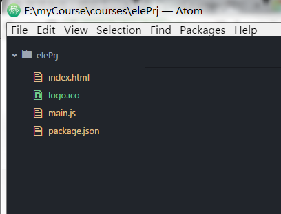

#如何使用 electron

##electron 介绍

`electron` 是一个框架，它是基于 `node.js` 和 `chromium` 的，它允许你使用javascript、html、css来编写跨平台的桌面应用，推荐使用 `atom` 编辑器。

>注：可以放心使用node，框架内部已经集成了

##安装 electron

前提已经安装了 `node` 、 `npm`.

一下安装都可使用 `npm` 或 `cnpm`.


```sh
# 全局安装 `electron` （推荐）
npm install electron-prebuilt -g

# 作为开发依赖局部安装
npm install electron-prebuilt --save-dev
```

>全局安装成功测试：cmd中输入electron -v


##构建项目

1、新建项目文件夹：elePrj ;

2、创建 `package.json` 加载文件 ;

```package.json
{
  "name": "electron",
  "version": "0.0.1",
  "description": "helloWorld",
  "author": "heyunjiang",
  "main": "main.js"
}
```

>注：`main` 指向入口文件 `main.js`

3、创建项目入口文件 `main.js` ;

>这里不再填充代码，可以使用项目中的 main.js 文件

4、创建 `index.html` 页面 ;

```index.html
<!DOCTYPE html>
<html>
  <head>
    <meta charset="utf-8">
    <title></title>
  </head>
  <body>
    helloWorld
  </body>
</html>

```

项目目录结构如图



##运行项目

命令行切换到项目根目录下，运行 `electron .`


运行结果：


到现在，一个hello world项目就运行成功了；
关于如何编写 `main.js` ，需要你去看 [eletron](https://github.com/electron/electron/tree/master/docs-translations/zh-CN) 官方文档

后续我会编写如何具体使用 `electron` 
